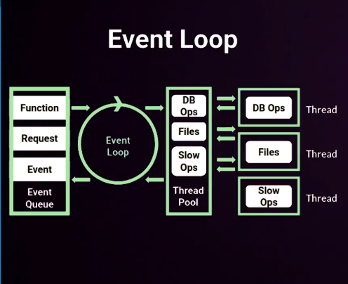

# Qué es el Event Loop

Es un proceso con un bucle que gestiona, de forma asíncrona, todos los eventos de tu aplicación. No va a bloquearse el bucle, recibe peticioens en todo momento, por esto es altamente concurrente.

Para que lleguen los eventos al Event Loop primero estarán en el _Event Queue_, aquí tendremos todos los eventos. Después pasarán al Event loop y si este no logra procesarlo rápidamente lo mandará al _Thread Pool_, aquí es donde se comenzará a gestionar todo de forma asíncrona.

El Event Loop funciona en un único hilo, que traen ventajas como que es muy responsivo, etc; como también desventajas, con seguridad, gestión de errores, etc

## Diagrama de como funciona el Event Loop

**Event Queue**: Contiene todos los eventos que se generan por nuestro código (Funciones, peticiones, etc.), estos eventos quedan en una cola que van pasando uno a uno al Event Loop.

**Event Loop**: Se encarga de resolver los eventos ultra rápidos que llegan desde el Event Queue. En caso de no poder resolverse rápido, enviá el evento al Thread Pool.

**Thread Pool**: Se encarga de gestionar los eventos de forma asíncrona. Una vez terminado lo devuelve al Event Loop. El Event Loop vera si lo pasa a Event Queue o no.
